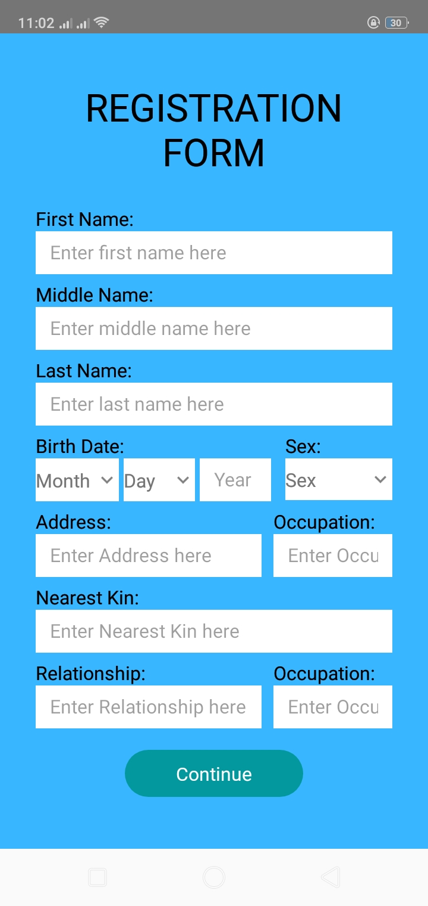
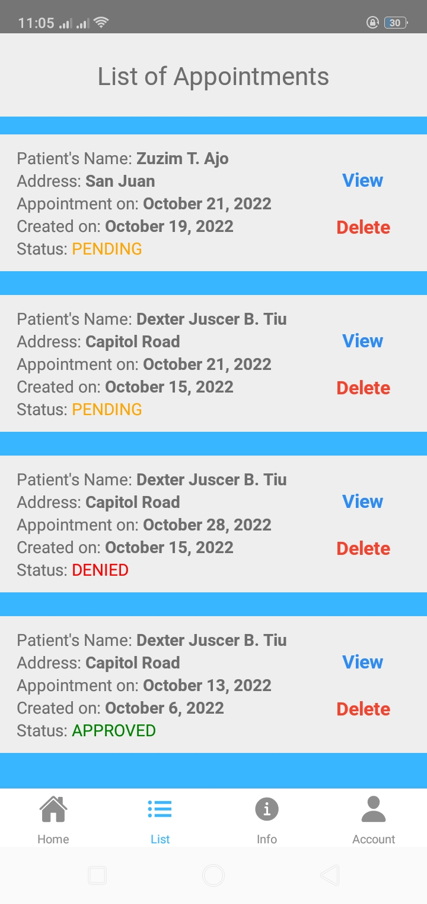
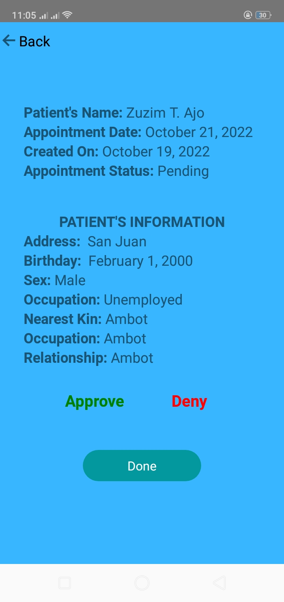

<h1 align="center">Bermudez Mobile Application</h1>

<h2 align="center">Bermudez Mobile Application is an application that was deployed in Bermudez Medical Clinic located at Brgy. San Isidro, Placer, SDN.</h2>

## ⚒️ Built with the following technologies:

<ul>
    <li>React-Native</li>
    <li>React Native Elements</li>
    <li>React Navigation</li>
    <li>Redux</li>
    
</ul>

## ✨ Features

<ul>
    <li>The patient can set appointment</li>
    <li>The patient can see his/her appointment on list</li>
    <li>The admin can approve or deny the appointment</li>
    <li>The admin can see the list of all appointment of the patients</li>
</ul>

## 🖼️ Preview

<h3 >Initial Registration</h3>
</img>
 
<h3 >Final Registration</h3>
</img>
<h3 >Login</h3>
</img>
 
<h3 >Home</h3>
</img>
 
<h3 >Calendar where the patient can set appointment</h3>
</img>
 
<h3 >List of appointment of patient</h3>
</img>
 
<h3 >Info</h3>
</img>
 
<h3 >Patient's account</h3>
</img>
 
<h3 >The admin list of pending appointments</h3>
</img>
 
<h3 >Viewing the pending appointment</h3>
</img>
 
<h3 >Admin's account</h3>
</img>
 
